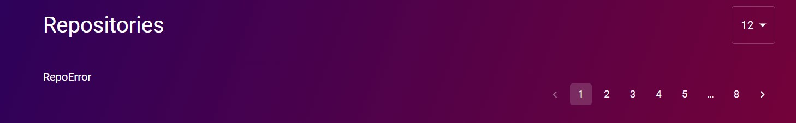

# Github Profile Task - Preimage


### Built with - Create React App

## Run:
1. Install dependencies:
    ```
    npm install
    ```
    or
    ```
    yarn
    ```


2. Add a `Personal Access Token` from Github in the `.env` file
    This step may be optional, but I came across a situation where I started recieving `403` error, which I suspected after searching on the web, maybe because of GitHub API rate-limitting unauthorized requests. Hence, it is recommended to complete this step.


3. Start the server
    ```
    npm start
    ```
    or 
    ```
    yarn start
    ```

## Usage:
The input field may confuse people as it doesn't have a search button, but to search at the moment, you'll just ned to hit enter.

## Tasks Completed:
[x] Using React 16+


[x] Using Create React App - I was planning on using NextJS as it provided so much more to use easily but I sticked with Create React App as that's what the team prefers and hence would be able to evaluate the code better


[x] `Material UI` used to create components. No other library used. At places where I found it relatively simpler or more custom, there I used `CSS Modules`.


[x] All Required Info asked in the PS is displayed


[x] README prepared.

## (Bonus Tasks)
[x] Loading State handled - User as well as Repos


[x] Error State handled - User as well as Repos



[x] Pagination


[ ] Dark Theme / Light Theme Toggle - was in the plan to be implemented but I'm skipping it for now - have to come up with some design first on what to change

## Next Todos:
[x] ~The Code can be significantly cleaned up and refactored, which will be my next step.~


[x] ~Error State handling better for different errors~


[x] ~Improve UI~


[ ] Dark and Light Theme